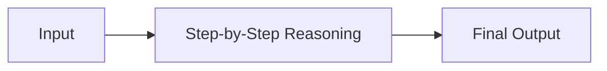

# B. Few-Shot Chain-of-Thought (CoT Prompting)

CoT introduces intermediate reasoning steps before providing the final answer.

```mermaid
graph LR
    A[Input] --> B[Step-by-Step Reasoning]
    B --> C[Final Output]
```

[Back to README](../README.md)
