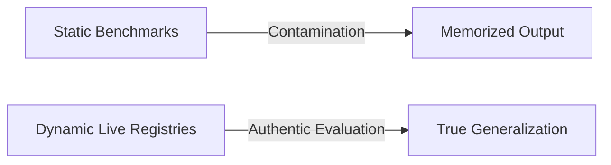

# The Data Contamination and Superficial Saturation Trap

Preventing models from memorizing benchmark data by using dynamic evaluation.

```mermaid
graph LR
    A[Static Benchmarks] -->|Contamination| B[Memorized Output]
    C[Dynamic Live Registries] -->|Authentic Evaluation| D[True Generalization]
```

[Back to README](../README.md)
