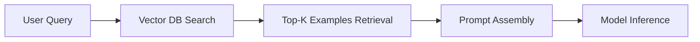

# The Dynamic & Retrieval-Augmented Selection Era (~2022–2024)

This era focuses on dynamically retrieving relevant examples for the prompt to improve few-shot performance.

[Back to README](../README.md)
