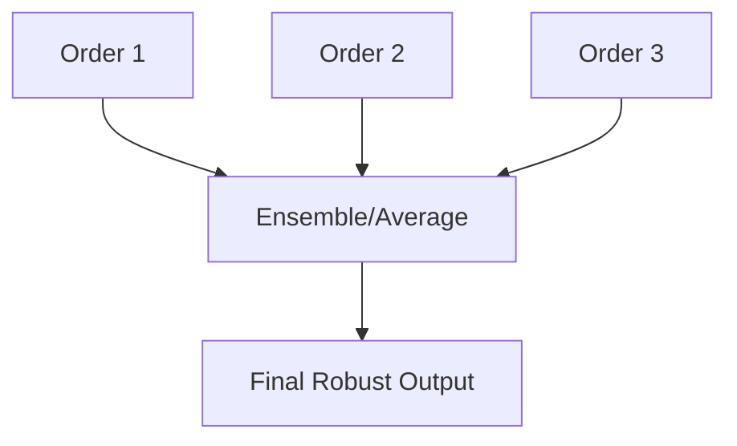

# C. Exemplar Order Permutation Scaling

Varying the order of examples helps mitigate the recency bias in LLMs.

```mermaid
graph TB
    A[Order 1] --> D[Ensemble/Average]
    B[Order 2] --> D
    C[Order 3] --> D
    D --> E[Final Robust Output]
```

[Back to README](../README.md)
