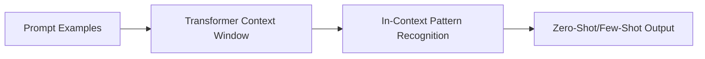

# The In-Context Learning Scaling Revolution (GPT-3, Brown et al., 2020)

In-context learning emerged with GPT-3, allowing models to learn from prompt examples without weight updates.

[Back to README](../README.md)
