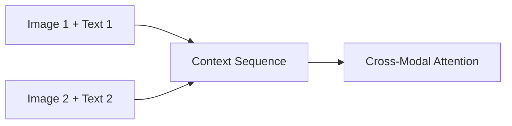

# D. Interleaved Cross-Modal Few-Shot Prompting

Combining text and images in few-shot prompts for Vision-Language Models.

```mermaid
graph LR
    A[Image 1 + Text 1] --> B[Context Sequence]
    C[Image 2 + Text 2] --> B
    B --> D[Cross-Modal Attention]
```

[Back to README](../README.md)
