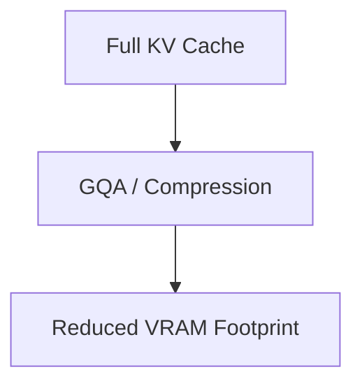

# The KV Cache Memory Inflation and Latency Wall

Addressing the challenges of large KV caches with techniques like Grouped-Query Attention.

```mermaid
graph TB
    A[Full KV Cache] --> B[GQA / Compression]
    B --> C[Reduced VRAM Footprint]
```

[Back to README](../README.md)
