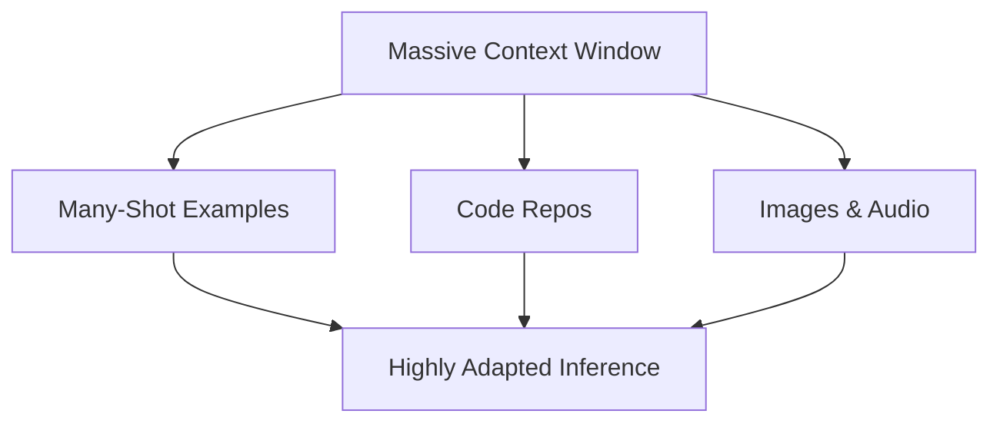

# The Many-Shot & Multi-Modal Long-Context Era (~2024–Present)

Modern models support massive context windows, enabling many-shot prompting with hundreds of examples.

[Back to README](../README.md)
