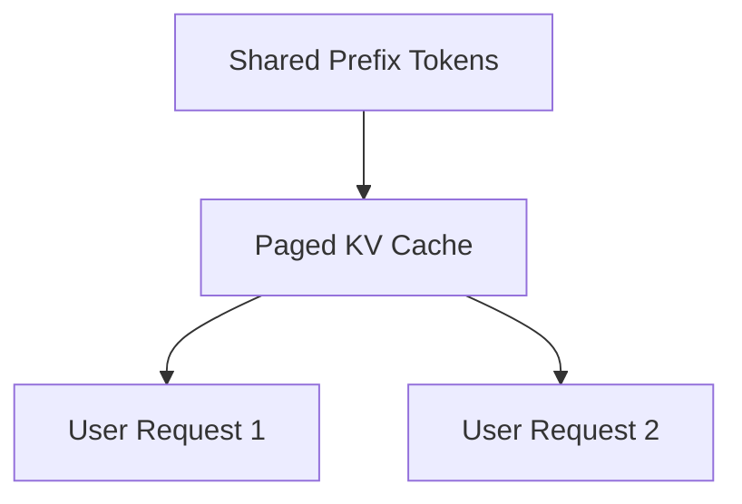

# PagedAttention Prefix Cache Locking

PagedAttention optimizes memory management by sharing prefix caches across requests.

```mermaid
graph TB
    A[Shared Prefix Tokens] --> B[Paged KV Cache]
    B --> C[User Request 1]
    B --> D[User Request 2]
```

[Back to README](../README.md)
