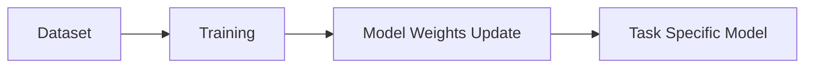

# The Parameter Fine-Tuning Dominance Era (Traditional Deep Learning, Pre-2020)

This era represents the traditional approach to machine learning where model weights are updated through backpropagation.

[Back to README](../README.md)
