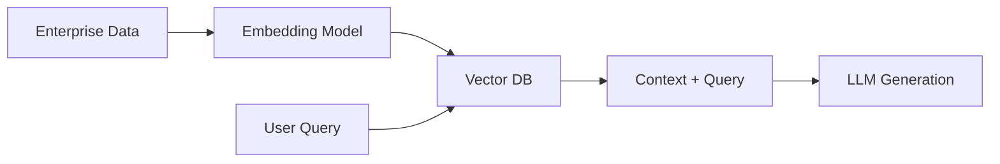

# Enterprise Retrieval-Augmented Generation (RAG Ingestion Frameworks)

Using enterprise data to ground model generations and prevent hallucinations.

```mermaid
graph LR
    A[Enterprise Data] --> B[Embedding Model]
    B --> C[Vector DB]
    D[User Query] --> C
    C --> E[Context + Query]
    E --> F[LLM Generation]
```

[Back to README](../README.md)
