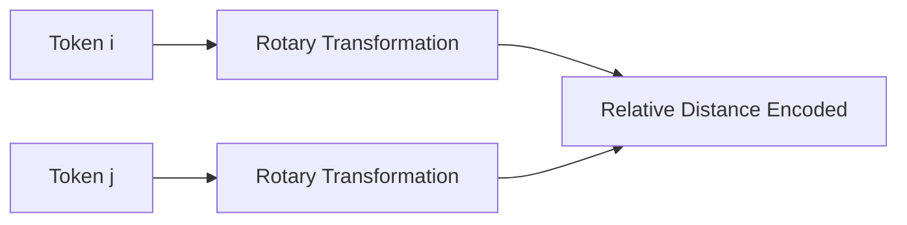

# Rotary Spatial Scaling Transformations (RoPE Adjustments)

RoPE allows models to handle very long sequences effectively by encoding relative positions.

```mermaid
graph LR
    A[Token i] --> B[Rotary Transformation]
    C[Token j] --> D[Rotary Transformation]
    B & D --> E[Relative Distance Encoded]
```

[Back to README](../README.md)
