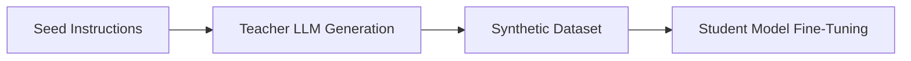

# Zero-Shot Synthetic Data Curation Loops (Self-Instruct)

Using strong models to generate synthetic instruction data for smaller models.

```mermaid
graph LR
    A[Seed Instructions] --> B[Teacher LLM Generation]
    B --> C[Synthetic Dataset]
    C --> D[Student Model Fine-Tuning]
```

[Back to README](../README.md)
