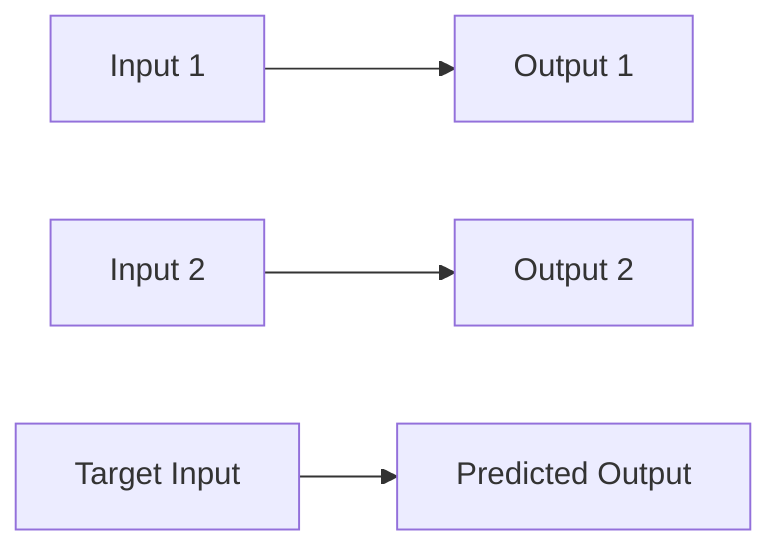

# A. Standard Input-Output Few-Shot Prompting

Standard I/O prompting maps inputs directly to outputs in the prompt context.

```mermaid
graph LR
    A[Input 1] --> B[Output 1]
    C[Input 2] --> D[Output 2]
    E[Target Input] --> F[Predicted Output]
```

[Back to README](../README.md)
